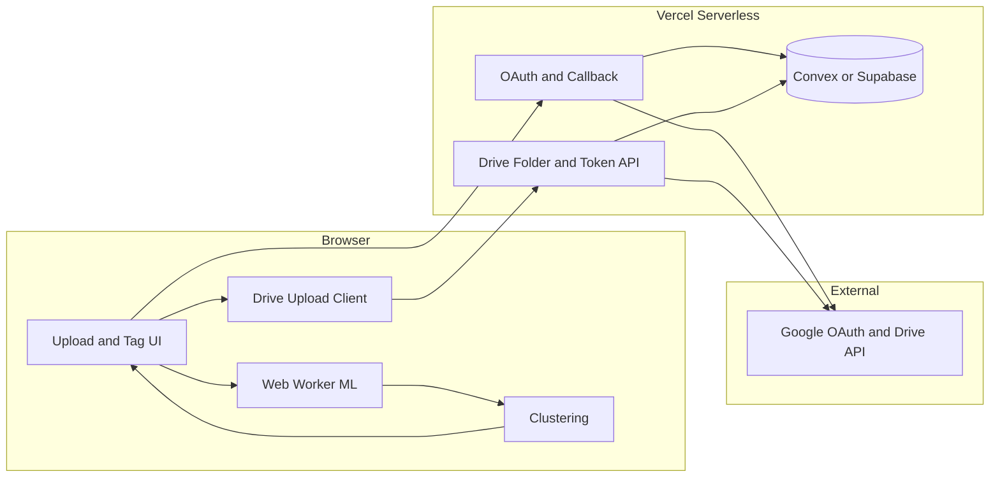

# Character Tagger – Implementation Plan

This plan implements the **ultra-free MVP architecture** (Option A) from the system design: client-only ML, no image storage on our infra, minimal serverless backend for Google OAuth and Drive. It is structured so the app can later evolve toward optional server assist and saved projects (Option B) without a rewrite.

---

## Phase 0: Prerequisites and decisions to lock first

Before coding, confirm these from the design doc (Section 10):

- **Character definition:** Same character = face match only, or face OR costume with user merge in UI.
- **Metadata persistence (v1):** Session-only (no account, no “re-open project”) vs user accounts + “save project” from day one. This plan assumes **session-only** for the first shippable version; adding Convex/Supabase auth + project storage is Phase 4.
- **Multi-character per photo:** One folder per character; each photo that has N characters is uploaded to N folders (one copy per character folder). Alternative: single “Group” folder—decide and implement consistently.
- **Drive scope:** `drive.file` (create and upload only) is sufficient for MVP; add `drive` read only if “organize existing Drive photos” is required.

No code in this phase; only documented decisions.

---

## Phase 1: Project scaffold and hosting

**Goal:** Repo, build, deploy to free tier with no ML or Drive yet.

**Stack:**

- **Frontend:** Next.js 14+ (App Router) or Vite + React; host on **Vercel** (free).
- **Package manager:** npm or pnpm; lockfile committed.
- **Lint/format:** ESLint + Prettier; optional TypeScript strict.

**Deliverables:**

- Initialize Next.js (or Vite) with TypeScript in `char-tagger`.
- Single landing page: “Upload photos” (button or dropzone; no processing yet).
- Configure for Vercel: `vercel.json` if needed; use default Next.js build.
- Env pattern: `.env.example` with placeholders for `GOOGLE_CLIENT_ID`, `GOOGLE_CLIENT_SECRET`, `NEXTAUTH_URL` (or equivalent); no secrets in repo.

**Folder structure (suggestion):**

```
src/
  app/           # or pages/ (Next) / src/ (Vite)
  components/    # UI: UploadZone, Button, Layout
  lib/           # pure utils, constants
  workers/       # Web Worker entry points (Phase 2)
  hooks/         # React hooks
public/
  models/        # Optional: lazy-loaded ML weights (Phase 2)
```

**Exit criteria:** `npm run build` passes; deploy to Vercel; landing page loads and shows upload UI (no backend yet).

---

## Phase 2: Client-side ML pipeline (detection + embeddings + clustering)

**Goal:** In-browser face detection, face embeddings, optional costume/appearance embedding, and clustering so “same character” gets one cluster id. No server, no Drive.

**2.1 Dependencies and workers**

- Add **TensorFlow.js** (or **ONNX Runtime Web**) and a small **face detection** model (e.g. BlazeFace / face-api.js style).
- Add a **face recognition** embedding model (128-d or 512-d); run in a **Web Worker** to avoid blocking the UI.
- Optional: a second path for “no face” → crop person bbox and run a single **appearance embedding** (e.g. person ReID or generic image embed); can be Phase 2b if time-constrained.

**2.2 Worker design**

- **Worker 1 (detection):** Input = image bytes/URL; output = list of bounding boxes (face and optionally full body). Batch images in chunks (e.g. 5) to control memory.
- **Worker 2 (embedding):** Input = cropped image per detection; output = embedding vector. Same batching strategy.
- Main thread: orchestrate pipeline, show progress (“Processing image 3 of 20…”), and collect `{ imageId, detectionIndex, bbox, embedding }[]`.

**2.3 Clustering**

- Implement in main thread (or dedicated worker if many embeddings): pairwise **cosine similarity** between all embeddings; **agglomerative clustering** or “merge if similarity > θ” with a tunable threshold.
- Assign **clusterId** (e.g. 1..K) to each detection; optionally persist θ in `localStorage` for user tuning later.
- Output: `{ imageId, detectionIndex, clusterId, bbox }[]` plus cluster representatives for UI (e.g. first detection per cluster).

**2.4 Integration with UI**

- After “Process” (or automatic after upload): run pipeline; then show **per-cluster groups** (e.g. “Character 1”, “Character 2”) with thumbnails. No persistence yet; in-memory + optional `sessionStorage` for refresh resilience.

**Exit criteria:** User can upload 10–20 images; pipeline runs in worker(s); results show grouped by character; no images sent to any server.

---

## Phase 3: Tag confirmation and edit UX

**Goal:** User can rename clusters, merge two clusters, split a cluster (assign detection to another or new cluster), and mark “Uncategorized” for detections with no face.

**3.1 Data model (client)**

- State: `clusters: Record<clusterId, { name: string, detectionIds: string[] }>` and `detections: Detection[]` (imageId, bbox, clusterId, embedding ref if needed for re-cluster).
- “Detection id” = stable id per detection (e.g. `imageId + index`).

**3.2 Actions**

- **Rename:** Change `clusters[id].name` (default “Character 1” → user string).
- **Merge:** Move all `detectionIds` from cluster A into B; delete A.
- **Split:** For one cluster, allow “move selected detections to new cluster” or “to existing cluster”; create new cluster if needed.
- **Uncategorized:** Allow assigning detections to a special cluster “Uncategorized” (or “Other”); they will still get a Drive folder unless we add “skip upload” rule.

**3.3 UI**

- List or grid of clusters; each cluster expands to show thumbnails of assigned detections.
- Buttons: Rename, Merge (select two), Split (select subset), Assign to cluster.
- Validation: no empty cluster names for upload; duplicate folder names in Drive handled (e.g. suffix or id).

**Exit criteria:** User can fully correct auto-tags before any export; state is consistent and ready for Phase 4/5.

---

## Phase 4: Google OAuth and token storage (minimal backend)

**Goal:** User can sign in with Google for Drive; we store refresh token securely; no image handling on server.

**4.1 Backend choice**

- Use **Vercel Serverless** (Next.js API routes) or **Cloudflare Workers**; no separate app server. Recommended: **Next.js API routes** on Vercel so one repo, one deploy.
- **Persistence for tokens:** **Convex** (free tier) or **Supabase** (free tier). Convex: one table `user_tokens` with `userId` (from Google), `refreshToken` (encrypted at rest if possible), `updatedAt`. Supabase: same schema in Postgres; use Row Level Security so users only see their own row.

**4.2 OAuth flow**

- **PKCE** for public client safety; scope: `https://www.googleapis.com/auth/drive.file` (or `drive` if read needed).
- Routes: `GET /api/auth/google` → redirect to Google; `GET /api/auth/callback` → exchange code + PKCE for tokens; store refresh token in Convex/Supabase; set httpOnly cookie with short-lived session id (or JWT) that maps to userId.
- Route: `GET /api/auth/me` → return current user id / email for UI (optional).

**4.3 Security**

- Never log or store image bytes; only token metadata and user id.
- Env: `GOOGLE_CLIENT_ID`, `GOOGLE_CLIENT_SECRET`; callback URL in Google Cloud Console must match production and preview URLs.

**Exit criteria:** User clicks “Sign in with Google”; after redirect, we have a valid refresh token stored and a session; “Save to Drive” can later call an API that uses this token.

---

## Phase 5: Google Drive upload

**Goal:** Create one folder per tag (cluster name); upload each photo into the folder(s) corresponding to its tag(s); multi-character photos go to multiple folders.

**5.1 Server-side helper (recommended)**

- **API route:** `POST /api/drive/folders` — accepts `tagNames: string[]`; uses stored refresh token to create folders (idempotent by name or by project id); returns `{ folderIdByName: Record<string, string> }`.
- **API route:** `POST /api/drive/upload-url` — accepts `folderId`, `fileName`, `mimeType`; returns a **resumable upload URL** (or multipart upload URL) so the **browser** can upload file bytes directly to Google (no image through our server). Alternative: browser uses Drive API with access token from our backend; backend endpoint returns short-lived **access token** only (no file data).

**5.2 Client flow**

- User clicks “Save to Drive”.
- If not logged in → redirect to OAuth (Phase 4).
- Call `/api/drive/folders` with unique tag names (including “Uncategorized” if used).
- For each (image, tag) pair: get upload URL or access token; in browser, `PUT` or `POST` file to Drive. Respect rate limits (e.g. 1000 req/100 s); batch with small delays if needed.
- Show progress: “Uploaded 12 of 40”; on errors, retry once and report failures.

**5.3 Idempotency and naming**

- Folder names: sanitize (no `/`, reserved names); if duplicate names, append suffix or cluster id. Decide whether to create a parent folder per “project” (e.g. “CharTagger – 2025-02”) for cleanliness.

**Exit criteria:** User can export all tagged photos to Drive in correct folders; no image bytes pass through our server; failures are visible and retriable.

---

## Phase 6: Polish, error handling, and docs

**Goal:** Production-ready MVP: errors surfaced, basic monitoring, and a short README for deployment.

**6.1 Error handling**

- **ML:** Model load failure (e.g. WebGL/WebGPU unavailable) → message and fallback to “manual tag only” (upload only, no auto-tag) or disable Process.
- **OAuth:** Denied or error → clear message and retry link.
- **Drive:** Quota or 403 → show message; suggest “fewer photos” or “try later”.
- **Network:** Timeout on upload → retry with backoff; save state so user can resume (optional: persist “pending uploads” in IndexedDB).

**6.2 Progress and UX**

- Processing: “Step 1/3: Detecting faces…” with progress bar or count.
- Upload: “Uploading 5 of 23 to Drive…”
- Success: “All photos saved to Drive” with link to open Drive (optional).

**6.3 Docs and ops**

- **README:** How to run locally; env vars; how to deploy to Vercel; Google Cloud setup (OAuth client, enable Drive API).
- **Privacy:** One-line in README or footer: “Photos are processed in your browser and uploaded only to your Google Drive; we do not store your images.”

**Exit criteria:** A new developer can clone, set env, and deploy; users see clear errors and progress.

---

## Phase 7 (optional): Path to “saved projects” (Option B)

**Goal:** Allow “Save project” and “Re-open project” without changing the zero-cost core.

**7.1 Metadata storage**

- Convex or Supabase: tables `projects` (id, userId, name, createdAt), `project_clusters` (projectId, clusterId, name), `project_detections` (projectId, imageId, detectionIndex, clusterId). Optionally store **embeddings** (vector or JSON) for “add more photos later” and re-run clustering with existing + new embeddings.

**7.2 Auth**

- Add simple auth (e.g. Convex auth or Supabase Auth) so `userId` is stable; link tokens table to same userId.

**7.3 UI**

- “Save project” → write metadata (and optionally embeddings) to DB; “My projects” list; “Open” → load metadata and optionally re-fetch thumbnails from Drive or show placeholders (we don’t store image URLs long-term unless we store only Drive file ids). If we don’t store image bytes, “re-open” shows cluster names and structure; re-uploading same photos could re-run pipeline and match by embedding to existing clusters (stretch).

**Exit criteria:** User can save and re-open a project; at least cluster names and structure persist; optional incremental tagging with stored embeddings.

---

## Architecture overview (MVP after Phase 5)




**Data flow (no images on our server):**

- Images: User device → Worker (detection/embedding) → Clustering → UI state; then browser → Google Drive only.
- Tokens: Google → Auth API → TokenDB; DriveAPI reads TokenDB to get refresh token and returns folder ids or upload URLs/tokens to client.

---

## Scaling and limits (reminder)

- **100 users:** Stay on free tiers; monitor Convex/Supabase usage and Drive API quota.
- **Break first:** Drive quota per user; token DB writes; client memory on low-end devices.
- **Upgrade order:** DB/hosting if free tier exceeded; then optional server-side ML fallback; then vector DB only if “re-open and add more” at scale is required.

---

## Risks and mitigations


| Risk                                | Mitigation                                                                                             |
| ----------------------------------- | ------------------------------------------------------------------------------------------------------ |
| Anime/cartoon face recognition poor | Test early with target art style; fallback to “Uncategorized” or costume embedding; allow merge in UI. |
| Client OOM on large batches         | Chunk images (e.g. 5–10); process in sequence in worker; show “Process in batches” hint.               |
| Drive rate limits                   | Throttle uploads (e.g. 5 concurrent, small delay); show progress and retry.                            |
| Free tier limits                    | Document Convex/Supabase/Vercel limits; add simple usage check before heavy ops (optional).            |


---

## Implementation order summary

1. **Phase 1** – Scaffold, deploy, upload UI only.
2. **Phase 2** – Client ML: detection, embeddings, clustering.
3. **Phase 3** – Tag confirm/edit: rename, merge, split.
4. **Phase 4** – Google OAuth + token storage (minimal backend).
5. **Phase 5** – Drive folder creation + browser upload.
6. **Phase 6** – Errors, progress, README, privacy note.
7. **Phase 7** (optional) – Saved projects and optional embeddings in DB.

Phases 1–5 deliver the MVP; 6 makes it shippable; 7 extends toward Option B without changing the zero-cost core.